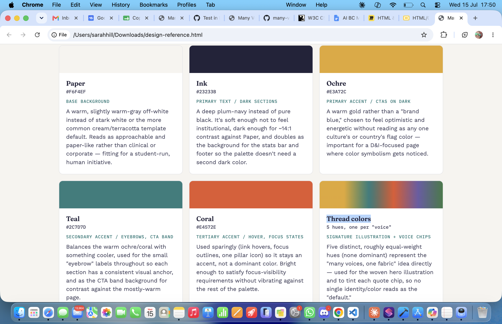

# [many-voices](https://sarahjhill.github.io/many-voices)

Developer: Sarah Hill ([sarahjhill](https://www.github.com/sarahjhill))

# Many Voices — Diversity & Inclusion Student Initiative

After to speaking to students and as a woman in tech with a diverse background myself, I felt like it was a good idea to build a diversity and inclusion club that is run by students themselves for students. Rather than reading about it from an institution, it provides an opportunity for students to grow together, understand each other and learn to respect and get along with all people and backgrounds in a safe environment. As well as that we can provide resourses and suppot information that is availble.

It is inevitable that we all won't agree on everything, but by growing a community together and helping each other we can all be stronger and make things easier.

In this website you will be able to see our mission, allow communities and individuals to speak and learn together, see local events and available resourses and find many ways to connect with us. 

**Site Mockups**
*([amiresponsive](https://ui.dev/amiresponsive?url=https://sarahjhill.github.io/many-voices), [photoshop](https://photoshop.adobe.com/?promoid=LCDWT9XV&lang=en&mv=other&mv2=tab), [claude ai](https://claude.ai/public/artifacts/5e3b2581-4904-46c4-97a6-06271754741d) ) *

## UX

Building this web site with the users in mind was at the forfront of this design. I wanted to call to the students in a way they can relate to and point them to the right places straight away.

#### 1. Strategy

**Purpose**
- Encourage users to join the Many Voices Club by becoming members and or turning up to events.
- Provide a different user experience to keep users informed by their peers and allow them to meet and talk to their peers in a safe space.
- Provide information and links to support that is available to them.

**Primary User Needs**
- Learn about the club’s purpose and events.
- Join the club and stay updated.
- Access responsive, user-friendly content.
- Allow their voice to be heard and see how the community how they casn help and how the community csan help them.

**Business Goals**
- Increase knowlege of the clubs events
- Provide knowlege of inclusivity and promote respect
- Boost participation in events and social media engagement.
- Promote causes that are associated with it.

#### 2. Scope

**[Features](#features)** (see below)

**Content Requirements**
- Clear, motivational text about the club’s mission.
- Event schedules and descriptions.
- Forms for membership sign-up.
- Give people in the community a voice and promote awareness with forums and interactive sections.

#### 3. Structure

**Information Architecture**
- **Navigation Menu**:
  - Accessible links in the navbar.
- **Hierarchy**:
  - Clear call-to-action buttons.
  - Prominent placement of events.
  - Provide resourse materials for help and support

**User Flow**
1. User lands on the home page → learns about the club’s mission.
2. Navigates to the schedule/timetable → sees sessions they can join.
3. Views the events → checks upcoming/past event details.
4. Signs up via the membership page.
5. Browses the gallery → explores the community spirit.

#### 4. Skeleton

**[Wireframes](#wireframes)** (see below)

#### 5. Surface

**Visual Design Elements**
- **[Colours](#colour-scheme)** (see below)
- **[Typography](#typography)** (see below)

### Colour Scheme

Explain your colors and color scheme. Consider adding a link and screenshot for your color scheme using [coolors](https://coolors.co/generate).

When you add a color to the palette, the URL is dynamically updated, making it easier for you to return back to your color palette later if needed. See example below:

--- END --- 

I used claude ai for suggestions of the color palette.

Why this palette over the obvious choices: websites in this space default to either (a) a single institutional blue, which reads corporate/cold, or (b) a rainbow gradient, which can feel like a stock "diversity" cliché rather than a considered brand. This palette keeps one warm neutral, one dark ink, and a small set of accent colors used consistently by role (ochre = primary action, teal = section labels, coral = interaction states, five threads = the "many voices" motif) — deliberate rather than decorative, and every text/background pairing was checked against WCAG AA contrast minimums.

- `#F6F4EF` paper. base background color.
- `#23233B` Primary text / dark sections
- `#E3A72C` Primary accent / CTAs on dark
- `#2C7D7D` Secondary accent / eyebrows, CTA band
- `#E4572E` Tertiary accent / hover, focus states
- `Thread colors"` Signature illustration + voice chips

### Typography

Explain any fonts and icon libraries used, like **Google Fonts**, **Font Awesome**, etc. Consider adding a link to each font used, the Font Awesome site (if used), or similar icon library.

⚠️ --- END --- ⚠️

- [Montserrat](https://fonts.google.com/specimen/Montserrat) was used for the primary headers and titles.
- [Lato](https://fonts.google.com/specimen/Lato) was used for all other secondary text.
- [Font Awesome](https://fontawesome.com) icons were used throughout the site, such as the social media icons in the footer.

## Responsiveness

To follow best practice, wireframes were developed for mobile, tablet, and desktop sizes.
I've used [Bootstrap](https://getbootstrap.com/) to make sure my site looks good on all screen sizes and used [Google chrome dev tools](https://developer.chrome.com/docs/devtools?gad_source=1&gad_campaignid=22379518754&gbraid=0AAAAAC1d8f40QHFTYh_nAiYyPVv-AXwGa&gclid=Cj0KCQjw39zSBhDhARIsANammDsu7eijDNzex9dhMAqVpGC9vDJsAl9DI32mthNNHSTZ5i4i1QrtVAUaAqVXEALw_wcB) to test it with. 

## Wireframes

| Page | Mobile | Tablet | Desktop |
| --- | --- | --- | --- |
| Home |  |  |  |
| Gallery |  |  |  |
| Signup |  |  |  |
| Confirmation |  |  |  |
| 404 |  |  |  |

## User Stories

| Target | Expectation | Outcome |
| --- | --- | --- |
| As a user | I would like to see examples of why I should join | so that I can learn about the club’s mission and purpose before deciding to join. |
| As a user | I would like to view the running schedule/timetable | so that I can decide when to join a session. |
| As a user | I would like to see the details of different running events | so that I can prepare accordingly. |
| As an user | I would like to view a gallery of past events | so that I can see photos of myself and others from previous runs. |
| As a user | I would like to sign up for the running club | so that I can join the community and participate in events. |
| As a user | I would like to follow the club on various platforms (e.g., Instagram, Facebook, Twitter) | so that I can stay updated with club news and events. |
| As a user | I would like the website to be fully responsive | so that I can easily navigate and access information from my phone, tablet, or desktop. |
| As a user | I would like to see a 404 error page if I get lost | so that it's obvious that I've stumbled upon a page that doesn't exist. |

## Features

⚠️ INSTRUCTIONS ⚠️

In this section, you should go over the different parts of your project, and describe each feature. You should explain what value each of the features provides for the user, focusing on your target audience, what they want to achieve, and how your project can help them achieve these things.

**IMPORTANT**: Remember to always include a screenshot of each individual feature!

⚠️ --- END --- ⚠️

### Existing Features

| Feature | Notes | Screenshot |
| --- | --- | --- |
| Navbar | Featured on all three pages, the full responsive navigation bar includes links to the Logo, Home page, Gallery, and Signup page, and is identical in each page to allow for easy navigation. On the smallest screens, a burger icon is used to toggle the navbar so it doesn't take up too much space. This section will allow the user to easily navigate from page to page across all devices without having to revert back to the previous page via the "back" button. The navbar is also `fixed`, so it stays in view even if the user has scrolled to the bottom of the page. |  |
| Hero Image | The landing includes a photo with text-overlay to allow the user to see exactly which location this site would be applicable to. This section introduces the user to *Love Running* with an eye-catching animation to grab their attention. |  |
| Club Ethos | The club ethos section will allow the user to see the benefits of joining the *Love Running* meetups, as well as the benefits of running overall. The user will see the value of signing up for the *Love Running* meetups. This should encourage the user to consider running as their form of exercise. |  |
| Schedule | This section will allow the user to see exactly when the meetups will happen, where they will be located, and how long the run will be (in kilometers). The type of run (trail or road) is also shown, to help runners choose the meetups that best match their preference. This section will be updated as these times change to keep the user up to date. |  |
| Footer | The footer includes links to the relevant social media sites for *Love Running*. The links will open in a new tab to allow easy navigation for the user. The footer is valuable to the user, as it encourages them to keep connected via social media. |  |
| Gallery | The gallery will provide the user with supporting images to see what the meet-ups look like. This section is valuable to the user, as they will be able to easily identify the types of events that the organization puts together. It's responsive so no images stretch or skew, showing images stacked by 1 on mobile, by 2 on smaller tablets, by 3 on desktop, and by 4 on larger screens. |  |
| Signup | This page will allow the user to sign up to *Love Running* and start their running journey with the community. The user will be able specify if they would like to take part in road, trail, or both types of running. The user will be asked to submit their full name and email address. |  |
| Confirmation | The confirmation page will give the illusion that the signup form was submitted successfully to the *Love Running* club. Due to the lack of a database or email system so far, this is a fake confirmation page, and will automatically redirect the user back to the home page after 10 seconds. |  |
| 404 | The 404 error page will indicate when a user has somehow navigated to a page that doesn't exist. This replaces the default GitHub Pages 404 page, and ties-in with the look and feel of the *Love Running* site by using the standard navbar and footer. |  |

### Future Features

- **Image Section**: Allow users to share and veiw their pictures.
- **Training Plans**: Offer customizable training plans for runners of all levels (beginner, intermediate, advanced) with notifications and reminders.
- **Event Registration & Payment**: Integrate an option for students to donate, suggest and pay for future events
- **Achievements & Badges**: Introduce a gamification system where users earn badges or achievements for supporting others and interacting.
- **Live Event Tracking**: Provide real-time tracking for major club events so users can follow along or support the community.
- **Students Blog**: Include a blog section for members to share their experiences, tips, and stories, fostering community engagement.
- **Weekly Challenges**: Implement weekly challenges or group challenges to keep users motivated and engaged.
- **Member Forums or Groups**: Introduce discussion boards or group chats for students to connect, discuss upcoming events, or share training tips.
- **Charity Partnerships**: Offer integration with local charities where club members can raise money or get support.

## Tools & Technologies

| Tool / Tech | Use |
| --- | --- |
|  | Generate README and TESTING templates. |
|  | Version control. (`git add`, `git commit`, `git push`) |
|  | Secure online code storage. |
|  | Local IDE for development. |
|  | Main site content and layout. |
|  | Design and layout. |
|  | Hosting the deployed front-end site. |
|  | Front-end CSS framework for modern responsiveness and pre-built components. |
|  | Icons. |
|  | Tutorials/Reference Guide |
|  | Help debug, troubleshoot, and explain things. |
|  | Help debug, troubleshoot, and explain things. |

--- END ---

## Agile Development Process

### GitHub Projects

⚠️ TIP ⚠️

Consider adding screenshots of your Projects Board(s), Issues (open and closed), and Milestone tasks.

⚠️ --- END ---⚠️

[GitHub Projects](https://www.github.com/sarahjhill/many-voices/projects) served as an Agile tool for this project. Through it, EPICs, User Stories, issues/bugs, and Milestone tasks were planned, then subsequently tracked on a regular basis using the Kanban project board.

### GitHub Issues

[GitHub Issues](https://www.github.com/sarahjhill/many-voices/issues) served as an another Agile tool. There, I managed my User Stories and Milestone tasks, and tracked any issues/bugs.

| Link | Screenshot |
| --- | --- |
|  |  |
|  |  |

### MoSCoW Prioritization

I've decomposed my Epics into User Stories for prioritizing and implementing them. Using this approach, I was able to apply "MoSCoW" prioritization and labels to my User Stories within the Issues tab.

- **Must Have**: guaranteed to be delivered - required to Pass the project (*max ~60% of stories*)
- **Should Have**: adds significant value, but not vital (*~20% of stories*)
- **Could Have**: has small impact if left out (*the rest ~20% of stories*)
- **Won't Have**: not a priority for this iteration - future features

## Testing

> [!NOTE]  
> For all testing, please refer to the [TESTING.md](TESTING.md) file.

## Deployment

### GitHub Pages

The site was deployed to GitHub Pages. The steps to deploy are as follows:

- In the [GitHub repository](https://www.github.com/sarahjhill/many-voices), navigate to the "Settings" tab.
- In Settings, click on the "Pages" link from the menu on the left.
- From the "Build and deployment" section, click the drop-down called "Branch", and select the **main** branch, then click "Save".
- The page will be automatically refreshed with a detailed message display to indicate the successful deployment.
- Allow up to 5 minutes for the site to fully deploy.

The live link can be found on [GitHub Pages](https://sarahjhill.github.io/many-voices).

### Local Development

This project can be cloned or forked in order to make a local copy on your own system.

#### Cloning

You can clone the repository by following these steps:

1. Go to the [GitHub repository](https://www.github.com/sarahjhill/many-voices).
2. Locate and click on the green "Code" button at the very top, above the commits and files.
3. Select whether you prefer to clone using "HTTPS", "SSH", or "GitHub CLI", and click the "copy" button to copy the URL to your clipboard.
4. Open "Git Bash" or "Terminal".
5. Change the current working directory to the location where you want the cloned directory.
6. In your IDE Terminal, type the following command to clone the repository:
	- `git clone https://www.github.com/sarahjhill/many-voices.git`
7. Press "Enter" to create your local clone.

Alternatively, if using Ona (formerly Gitpod), you can click below to create your own workspace using this repository.

**Please Note**: in order to directly open the project in Ona (Gitpod), you should have the browser extension installed. A tutorial on how to do that can be found [here](https://www.gitpod.io/docs/configure/user-settings/browser-extension).

#### Forking

By forking the GitHub Repository, you make a copy of the original repository on our GitHub account to view and/or make changes without affecting the original owner's repository. You can fork this repository by using the following steps:

1. Log in to GitHub and locate the [GitHub Repository](https://www.github.com/sarahjhill/many-voices).
2. At the top of the Repository, just below the "Settings" button on the menu, locate and click the "Fork" Button.
3. Once clicked, you should now have a copy of the original repository in your own GitHub account!

### Local VS Deployment

⚠️ INSTRUCTIONS ⚠️

Use this space to discuss any differences between the local version you've developed, and the live deployment site. Generally, there shouldn't be [m]any major differences, so if you honestly cannot find any differences, feel free to use the following example:

⚠️ --- END --- ⚠️

There are no remaining major differences between the local version when compared to the deployed version online.

## Credits

⚠️ INSTRUCTIONS ⚠️

In the following sections, you need to reference where you got your content, media, and any extra help. It is common practice to use code from other repositories and tutorials (which is totally acceptable), however, it is important to be very specific about these sources to avoid potential plagiarism.

⚠️ --- END ---⚠️

### Content

⚠️ INSTRUCTIONS ⚠️

Use this space to provide attribution links for any borrowed code snippets, elements, and resources. Ideally, you should provide an actual link to every resource used, not just a generic link to the main site. If you've used multiple components from the same source (such as Bootstrap), then you only need to list it once, but if it's multiple Codepen samples, then you should list each example individually. If you've used AI for some assistance (such as ChatGPT or Perplexity), be sure to mention that as well. A few examples have been provided below to give you some ideas.

Eventually you'll want to learn how to use Git branches. Here's a helpful tutorial called [Learn Git Branching](https://learngitbranching.js.org) to bookmark for later.

⚠️ --- END ---⚠️

| Source | Notes |
| --- | --- |
| [Markdown Builder](https://markdown.2bn.dev) | Help generating Markdown files |
| [Chris Beams](https://chris.beams.io/posts/git-commit) | "How to Write a Git Commit Message" |
| [Love Running](https://codeinstitute.net) | Code Institute walkthrough project inspiration |
| [ChatGPT](https://chatgpt.com) | Help with code logic and explanations |

### Media

⚠️ INSTRUCTIONS ⚠️

Use this space to provide attribution links to any media files borrowed from elsewhere (images, videos, audio, etc.). If you're the owner (or a close acquaintance) of some/all media files, then make sure to specify this information. Let the assessors know that you have explicit rights to use the media files within your project. Ideally, you should provide an actual link to every media file used, not just a generic link to the main site, unless it's AI-generated artwork.

Looking for some media files? Here are some popular sites to use. The list of examples below is by no means exhaustive.

- Images
    - [Pexels](https://www.pexels.com)
    - [Unsplash](https://unsplash.com)
    - [Pixabay](https://pixabay.com)
    - [Lorem Picsum](https://picsum.photos) (placeholder images)
    - [Wallhere](https://wallhere.com) (wallpaper / backgrounds)
    - [This Person Does Not Exist](https://thispersondoesnotexist.com) (reload to get a new person)
- Audio
    - [Audio Micro](https://www.audiomicro.com/free-sound-effects)
    - [Button Clicks](https://www.zapsplat.com/sound-effect-category/button-clicks)
    - [Lasers & Weapons](https://www.zapsplat.com/sound-effect-category/lasers-and-weapons/page/5)
    - [Puzzle Music](https://soundimage.org/puzzle-music)
    - [Camtasia Audio](https://library.techsmith.com/camtasia/assets/Audio)
- Video
    - [Videvo](https://www.videvo.net)
- Image Compression
    - [TinyPNG](https://tinypng.com) (for images <5MB)
    - [CompressPNG](https://compresspng.com) (for images >5MB)

A few examples have been provided below to give you some ideas on how to do your own Media credits.

⚠️ --- END ---⚠️

| Source | Notes |
| --- | --- |
| [favicon.io](https://favicon.io) | Generating the favicon |
| [Love Running](https://codeinstitute.net) | Sample images provided from the walkthrough projects |
| [Font Awesome](https://fontawesome.com) | Icons used throughout the site |
| [Pexels](https://images.pexels.com/photos/416160/pexels-photo-416160.jpeg) | Hero image |
| [Wallhere](https://c.wallhere.com/images/9c/c8/da4b4009f070c8e1dfee43d25f99-2318808.jpg!d) | Background wallpaper |
| [Pixabay](https://cdn.pixabay.com/photo/2017/09/04/16/58/passport-2714675_1280.jpg) | Background wallpaper |
| [DALL-E 3](https://openai.com/index/dall-e-3) | AI generated artwork |
| [TinyPNG](https://tinypng.com) | Compressing images < 5MB |
| [CompressPNG](https://compresspng.com) | Compressing images > 5MB |
| [CloudConvert](https://cloudconvert.com/webp-converter) | Converting images to `.webp` |

### Acknowledgements

⚠️ INSTRUCTIONS ⚠️

Use this space to provide attribution and acknowledgement to any supports that helped, encouraged, or supported you throughout the development stages of this project. It's always lovely to appreciate those that help us grow and improve our developer skills. A few examples have been provided below to give you some ideas.

⚠️ --- END ---⚠️

- I would like to thank my Code Institute mentor, [Tim Nelson](https://www.github.com/TravelTimN) for the support throughout the development of this project.
- I would like to thank the [Code Institute](https://codeinstitute.net) Tutor Team for their assistance with troubleshooting and debugging some project issues.
- I would like to thank the [Code Institute Slack community](https://code-institute-room.slack.com) and [Code Institute Discord community](https://discord-portal.codeinstitute.net) for the moral support; it kept me going during periods of self doubt and impostor syndrome.
- I would like to thank my partner, for believing in me, and allowing me to make this transition into software development.
- I would like to thank my employer, for supporting me in my career development change towards becoming a software developer.

