# [many-voices](https://sarahjhill.github.io/many-voices)

Developer: Sarah Hill ([sarahjhill](https://www.github.com/sarahjhill))

# Many Voices — Diversity & Inclusion Student Initiative

After to speaking to students and as a woman in tech with a diverse background myself, I felt like it was a good idea to build a diversity and inclusion club that is run by students themselves for students. Rather than reading about it from an institution, it provides an opportunity for students to grow together, understand each other and learn to respect and get along with all people and backgrounds in a safe environment. As well as that we can provide resourses and suppot information that is availble.

It is inevitable that we all won't agree on everything, but by growing a community together and helping each other we can all be stronger and make things easier.

In this website you will be able to see our mission, allow communities and individuals to speak and learn together, see local events and available resourses and find many ways to connect with us. 

**Site Mockups**
*([amiresponsive](https://ui.dev/amiresponsive?url=https://sarahjhill.github.io/many-voices), [photoshop](https://photoshop.adobe.com/?promoid=LCDWT9XV&lang=en&mv=other&mv2=tab), [claude ai](https://claude.ai/public/artifacts/5e3b2581-4904-46c4-97a6-06271754741d) ) *

## UX

Building this web site with the users in mind was at the forfront of this design. I wanted to call to the students in a way they can relate to and point them to the right places straight away.

#### 1. Strategy

**Purpose**
- Encourage users to join the Many Voices Club by becoming members and or turning up to events.
- Provide a different user experience to keep users informed by their peers and allow them to meet and talk to their peers in a safe space.
- Provide information and links to support that is available to them.

**Primary User Needs**
- Learn about the club’s purpose and events.
- Join the club and stay updated.
- Access responsive, user-friendly content.
- Allow their voice to be heard and see how the community how they casn help and how the community csan help them.

**Business Goals**
- Increase knowlege of the clubs events
- Provide knowlege of inclusivity and promote respect
- Boost participation in events and social media engagement.
- Promote causes that are associated with it.

#### 2. Scope

**[Features](#features)** (see below)

**Content Requirements**
- Clear, motivational text about the club’s mission.
- Event schedules and descriptions.
- Form for membership sign-up.
- Give people in the community a voice and promote awareness with forums and interactive sections.

#### 3. Structure

**Information Architecture**
- **Navigation Menu**:
  - Accessible links in the navbar.
- **Hierarchy**:
  - Clear call-to-action buttons.
  - Prominent placement of events.
  - Provide resourse materials for help and support
  - Allow them to sign up for updates

**User Flow**
1. User lands on the home page → learns about the club’s mission.
2. Navigates to the schedule/timetable → sees sessions they can join.
3. Views the events → checks upcoming/past event details.
4. Signs up via the membership page.
5. Browses the gallery → explores the community spirit.

#### 4. Skeleton

**[Wireframes](#wireframes)** (see below)

#### 5. Surface

**Visual Design Elements**
- **[Colours](#colour-scheme)** (see below)
- **[Typography](#typography)** (see below)

### Colour Scheme

I used [claude ai](https://claude.ai/public/artifacts/5e3b2581-4904-46c4-97a6-06271754741d) for suggestions of the color palette.

Why this palette over the obvious choices: websites in this space default to either (a) a single institutional blue, which reads corporate/cold, or (b) a rainbow gradient, which can feel like a stock "diversity" cliché rather than a considered brand. This palette keeps one warm neutral, one dark ink, and a small set of accent colors used consistently by role (ochre = primary action, teal = section labels, coral = interaction states, five threads = the "many voices" motif) — deliberate rather than decorative, and every text/background pairing was checked against WCAG AA contrast minimums.

- `#F6F4EF` paper. base background color.
- `#23233B` Primary text / dark sections
- `#E3A72C` Primary accent / CTAs on dark
- `#2C7D7D` Secondary accent / eyebrows, CTA band
- `#E4572E` Tertiary accent / hover, focus states
- `Thread colors"` Signature illustration + voice chips

### Typography

Explain any fonts and icon libraries used, like **Google Fonts**, **Font Awesome**, etc. Consider adding a link to each font used, the Font Awesome site (if used), or similar icon library.

--- END ---

- [Display — Fraunces](https://fonts.google.com/specimen/Montserrat) A warm, slightly quirky humanist serif instead of the generic geometric sans most templates default to. Gives headlines personality and warmth without looking decorative or hard to read.
- [Body — Work Sans](https://fonts.google.com/specimen/Lato) A clean, highly legible grotesque sans for body copy — neutral enough not to compete with Fraunces, and reads well at small sizes for long paragraphs.
- [Utility — IBM Plex Mono](https://fontawesome.com) Used only for labels, stats, dates, and eyebrows — the monospace rhythm signals "metadata" at a glance and keeps those small elements from being mistaken for body text.

## Responsiveness

I've used [Bootstrap](https://getbootstrap.com/) to make sure my site looks good on all screen sizes and used [Google chrome dev tools](https://developer.chrome.com/docs/devtools?gad_source=1&gad_campaignid=22379518754&gbraid=0AAAAAC1d8f40QHFTYh_nAiYyPVv-AXwGa&gclid=Cj0KCQjw39zSBhDhARIsANammDsu7eijDNzex9dhMAqVpGC9vDJsAl9DI32mthNNHSTZ5i4i1QrtVAUaAqVXEALw_wcB) to test it with. 
([amiresponsive](https://ui.dev/amiresponsive?url=https://sarahjhill.github.io/many-voices)show a lovely demonstration of how it looks on different screens. You can interactively scroll on them to see the whole view.

## Wireframes

| Page | Mobile | Tablet | Desktop |
| --- | --- | --- | --- |
| Fullscreen | 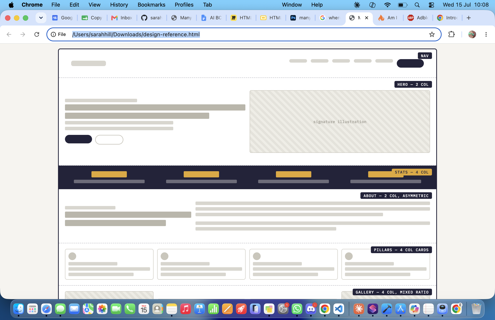 | | |
| Longshot |  |  |  |
| psd | 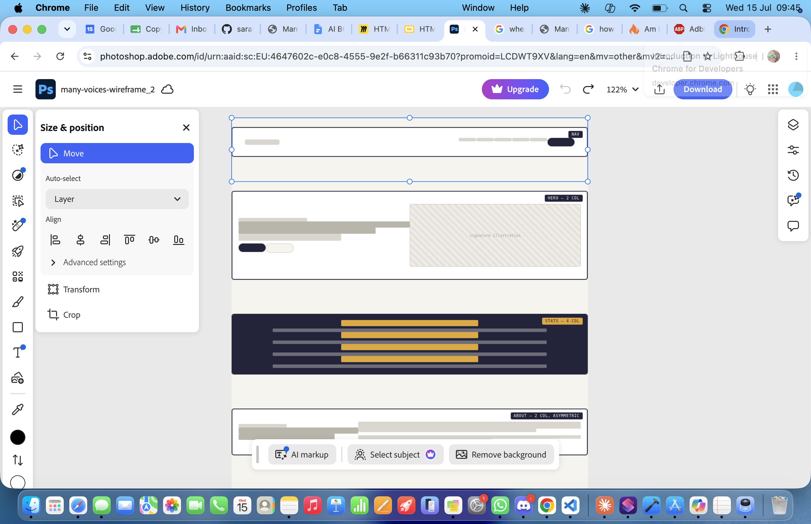 |  |  |
| Viewport |  |  | 

## User Stories

 1. Prospective member browsing the site
As a student who's never heard of Many Voices, I want to quickly understand what the group stands for and does, so that I can decide if it's worth getting involved.
Acceptance criteria: Hero section states the mission in one sentence; Pillars section is visible without scrolling past the fold on desktop; nav lets me jump to About in one click.

2. Student seeking a peer mentor
As a student struggling to find community, I want to sign up for the mentorship circle directly from the site, so that I don't have to email someone and wait.
Acceptance criteria: "Get Involved" CTA leads to a mentorship sign-up path; sign-up deadline is visible on the events list; confirmation is shown after submitting.

3. Ally wanting to support without overstepping
As a student who wants to be a good ally, I want guidance on how to get involved appropriately, so that I contribute without taking up space meant for others.
Acceptance criteria: Allyship pillar has its own description distinct from the other three; "Join" CTA language doesn't imply membership is restricted; at least one resource or event is framed as ally-focused.

4. Student reading peer stories before joining
As a hesitant student, I want to read real experiences from current members, so that I can gauge whether I'd feel welcome.
Acceptance criteria: Voices section shows at least 4 distinct quotes with name and year; each quote is attributed to a specific (even if pseudonymous) student, not anonymous copy.

5. Student needing urgent support resources
As a student in distress, I want to find relevant campus support resources fast, so that I get help without digging through unrelated content.
Acceptance criteria: Resources section is reachable from the main nav; each resource card names what it's for in plain language; links open the correct external page.

## Features

- A friendly and inclusive header to clearly show what we are about and who we are for with an easy to use navigation so you can quickly scroll to the parts you want.

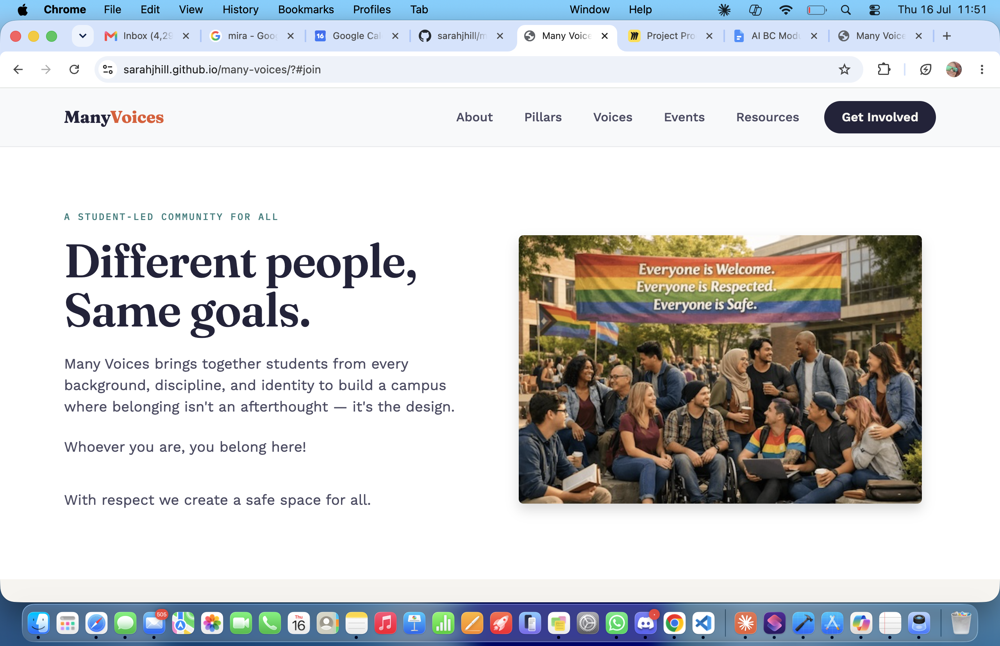

- What we stand for section promoting safy and inclusion within the community. The four pillars of diversity and inclusion.

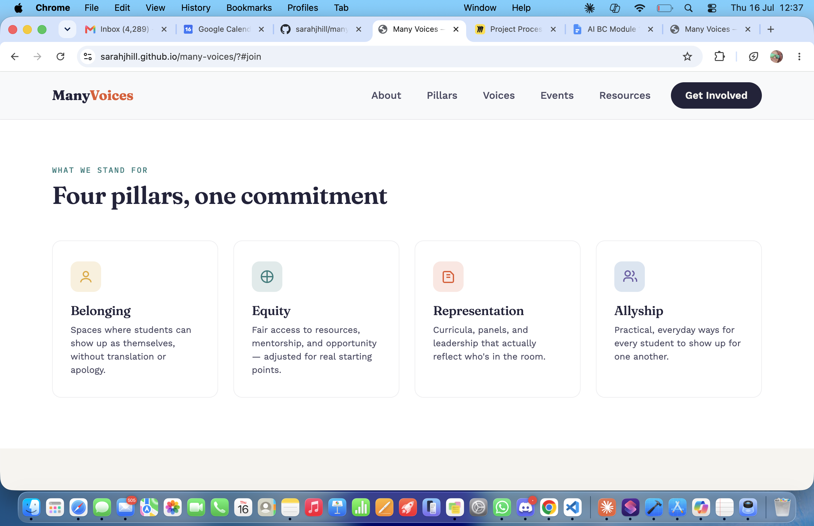

- The voices section currently has things people have said about their time with us however this will be updated when we have frown our community for users to be able to interact, leave stories and photos and share news.

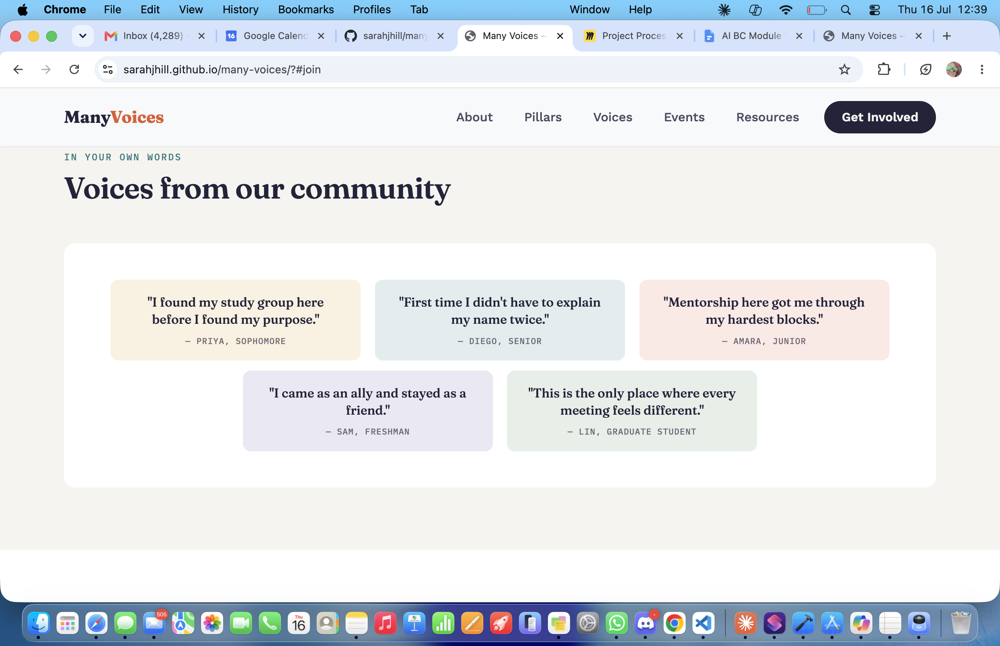

- The events section has all the information of the latest local events.

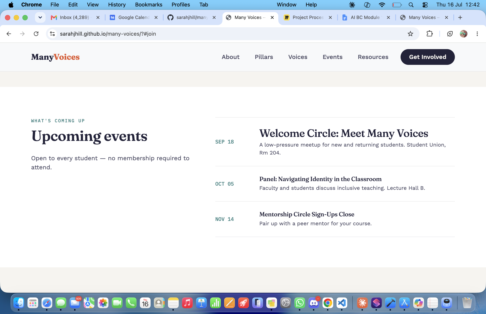

- The resourses section has links to external support that is available to them.

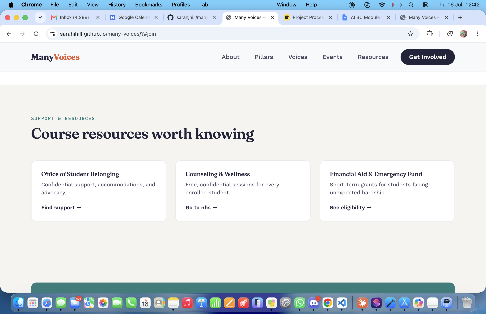

- The email section allow the user to register their interest so we can add them to a mailing list and keep them informed of all up and coming events.

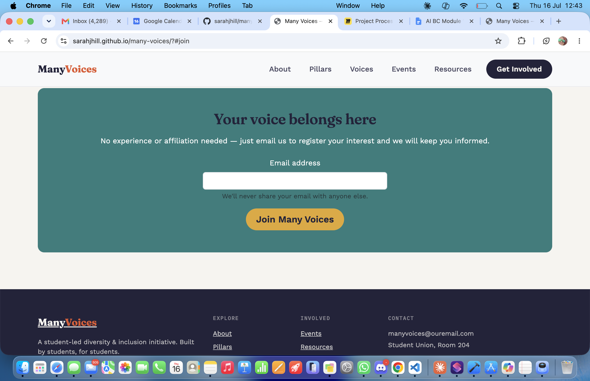

You can also see the footer above which has quick links, contact information and I have included my credits with a link to my github profile.

--- END ---

### Future Features

- **Interactive Section**: Allow users to share and veiw their pictures, stories and interact with each other
- **Event Registration & Payment**: Integrate an option for students to donate, suggest and pay for future events
- **Achievements & Badges**: Introduce a gamification system where users earn badges or achievements for supporting others and interacting.

## Tools & Technologies

| Tool / Tech | Use |
| --- | --- |
|  | Generate README and TESTING templates. |
|  | Version control. (`git add`, `git commit`, `git push`) |
|  | Secure online code storage. |
|  | Local IDE for development. |
|  | Main site content and layout. |
|  | Design and layout. |
|  | Hosting the deployed front-end site. |
|  | Front-end CSS framework for modern responsiveness and pre-built components. |
|  | Icons. |
|  | Tutorials/Reference Guide |
|  | Help debug, troubleshoot, and explain things. |
|  | Help debug, troubleshoot, and explain things. |

--- END ---

## Agile Development Process

### GitHub Projects

[GitHub Projects](https://www.github.com/sarahjhill/many-voices/projects) served as an Agile tool for this project. Through it, EPICs, User Stories, issues/bugs, and Milestone tasks were planned, then subsequently tracked on a regular basis using the Kanban project board.

### GitHub Issues

[GitHub Issues](https://www.github.com/sarahjhill/many-voices/issues) served as an another Agile tool. There, I managed my User Stories and Milestone tasks, and tracked any issues/bugs.

### MoSCoW Prioritization

I've decomposed my Epics into User Stories for prioritizing and implementing them. Using this approach, I was able to apply "MoSCoW" prioritization and labels to my User Stories within the Issues tab.

- **Must Have**: guaranteed to be delivered - required to Pass the project (*max ~60% of stories*)
- **Should Have**: adds significant value, but not vital (*~20% of stories*)
- **Could Have**: has small impact if left out (*the rest ~20% of stories*)
- **Won't Have**: not a priority for this iteration - future features

[Github project board](https://github.com/users/sarahjhill/projects/9)

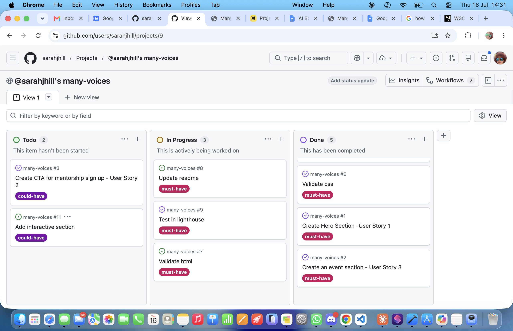

## Testing

HTML validated with no errors with [w3c validator](https://validator.w3.org/nu/?doc=https%3A%2F%2Fsarahjhill.github.io%2Fmany-voices%2F)

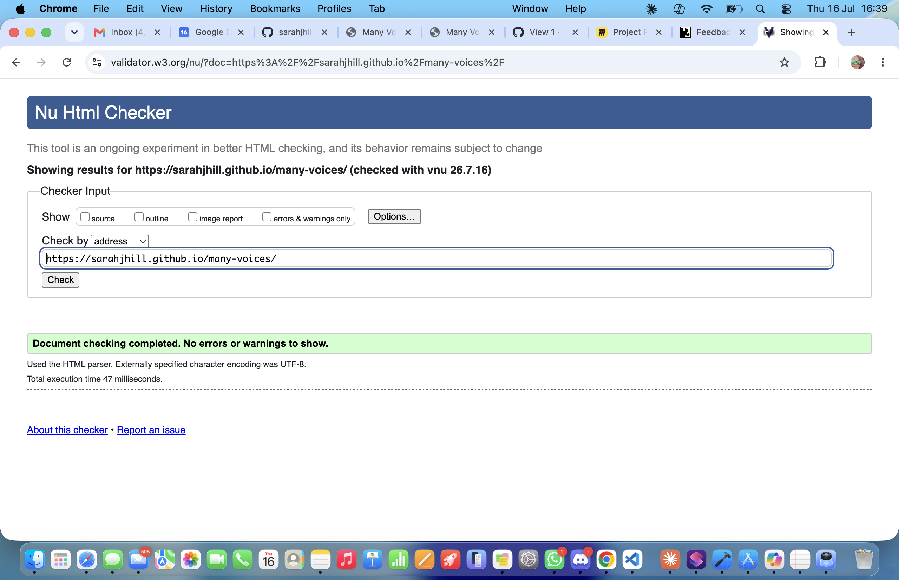

CSS validation passed with no issues with [w3c](hhttps://jigsaw.w3.org/css-validator/validator) 

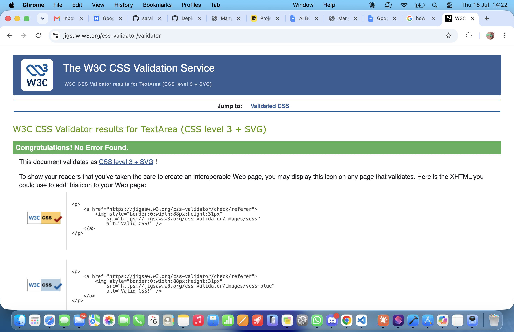

I tested proformance with [Google lighthouse](https://developer.chrome.com/docs/lighthouse) with optimal performance outcome.

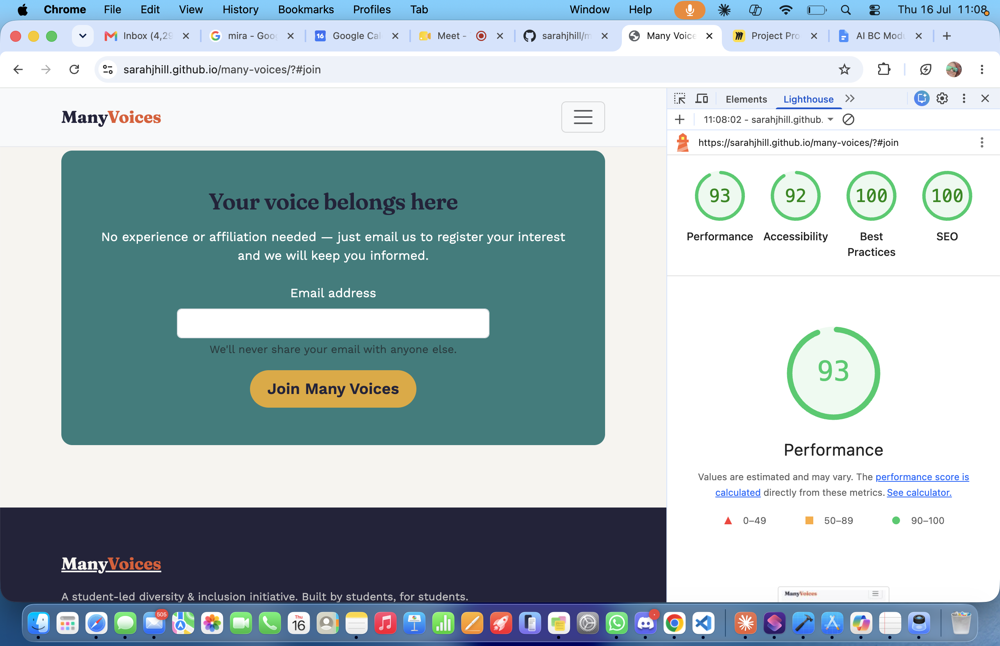

## Deployment

### GitHub Pages

The site was deployed to GitHub Pages. The steps to deploy are as follows:

- In the [GitHub repository](https://www.github.com/sarahjhill/many-voices), navigate to the "Settings" tab.
- In Settings, click on the "Pages" link from the menu on the left.
- From the "Build and deployment" section, click the drop-down called "Branch", and select the **main** branch, then click "Save".
- The page will be automatically refreshed with a detailed message display to indicate the successful deployment.
- Allow up to 5 minutes for the site to fully deploy.

The live link can be found on [GitHub Pages](https://sarahjhill.github.io/many-voices).

### Local Development

This project can be cloned or forked in order to make a local copy on your own system.

#### Cloning

You can clone the repository by following these steps:

1. Go to the [GitHub repository](https://www.github.com/sarahjhill/many-voices).
2. Locate and click on the green "Code" button at the very top, above the commits and files.
3. Select whether you prefer to clone using "HTTPS", "SSH", or "GitHub CLI", and click the "copy" button to copy the URL to your clipboard.
4. Open "Git Bash" or "Terminal".
5. Change the current working directory to the location where you want the cloned directory.
6. In your IDE Terminal, type the following command to clone the repository:
	- `git clone https://www.github.com/sarahjhill/many-voices.git`
7. Press "Enter" to create your local clone.

#### Forking

By forking the GitHub Repository, you make a copy of the original repository on our GitHub account to view and/or make changes without affecting the original owner's repository. You can fork this repository by using the following steps:

1. Log in to GitHub and locate the [GitHub Repository](https://www.github.com/sarahjhill/many-voices).
2. At the top of the Repository, just below the "Settings" button on the menu, locate and click the "Fork" Button.
3. Once clicked, you should now have a copy of the original repository in your own GitHub account!

### Local VS Deployment

There are no remaining major differences between the local version when compared to the deployed version online.

## Credits

[Claude ai](https://ai-chat.pro/?model=claude&utm_source=google&utm_medium=cpc&utm_term=claude%20ai&device=c&matchtype=e&network=g&utm_campaign=15.06_WW_search.models.desktop.en&gad_source=1&gad_campaignid=23947157923&gbraid=0AAAABD05XUB0vpHja4lTqyV1TqCls9ypu&gclid=Cj0KCQjwguLSBhDLARIsAH-yPrEEKrckNb9H0N3KtjCk42Xubh2HAR65SyNENKeqJo70A1eWLaUMdi4aAt8REALw_wcB) was used to choose the color scheme and fonts.

[Bootstrap 5.3](https://getbootstrap.com/docs/5.3/getting-started/introduction/) was used for the code to make the sections and forms and navbar. Also to make sure the site was responsive and looking good on all devises.

[co pilot](https://copilot.microsoft.com/) was used to create the hero image and edit for web optimisation.

 --- END ---

### Content

Images were generated with copiot.
Copy was suggested by Claude ai

--- END ---

| Source | Notes |
| --- | --- |
| [Markdown Builder](https://markdown.2bn.dev) | Help generating Markdown files |
| [Chris Beams](https://chris.beams.io/posts/git-commit) | "How to Write a Git Commit Message" |
| [Process](https://codeinstitute.net) | Code Institute walkthrough project inspiration |
| [Claude ai](https://claude.ai) | Help with code logic and explanations |

### Media

- Images
    - [co pilot](https://copilot.microsoft.com/)
    - SVG
- Image Compression
    - [Photoshop](https://www.adobe.com/uk/products/photoshop/landpa.html?mv=search&mv=search&mv2=paidsearch&sdid=2XBSBWBF&ef_id=Cj0KCQjwguLSBhDLARIsAH-yPrGxeuB5azjIIBpwc5EPToqGGZg2TfWrpO-4sOHI_FMIsML2MzqFhQgaAtulEALw_wcB:G:s&s_kwcid=AL!3085!3!763734636132!e!!g!!photoshop!22787824038!180268875777&gad_source=1&gad_campaignid=22787824038&gbraid=0AAAAADraYsJrMVhd5C65mSzo4xe86QI9Z&gclid=Cj0KCQjwguLSBhDLARIsAH-yPrGxeuB5azjIIBpwc5EPToqGGZg2TfWrpO-4sOHI_FMIsML2MzqFhQgaAtulEALw_wcB) 

--- END ---

### Acknowledgements
Thank you to [Code Insitute](https://codeinstitute.net/) for teaching the building process and coding and also to the mentors for supporting and inspiring.

- I would like to thank my Code Institute mentor, [Tim Nelson](https://www.github.com/TravelTimN) for the support throughout the development of this project.
- I would like to thank the [Code Institute](https://codeinstitute.net) Tutor Team for their assistance with troubleshooting and debugging some project issues.
- I would also like to thank [Code Institute Discord community](https://discord-portal.codeinstitute.net) for the moral support; it kept me going during periods of self doubt and impostor syndrome.
- I would like to thank my partner, for believing in me, and inspiring me with many great ideas that I now have me to make this transition into software development.

